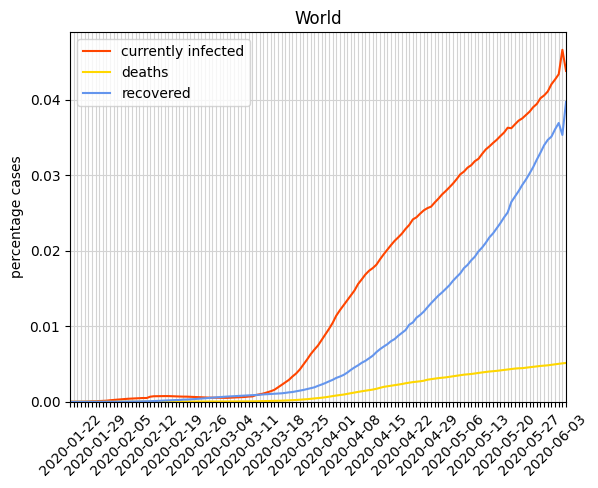

# covid19_percentage
Tracking the spread of covid-19 in percentage of population (one hour build)

**main.py** provides a visualization of covid-19 cases per country (also as a percentage of population size) or of the 
entire world, such as the following graph:

**most_infected.py** outputs a table of all countries, showing the number of currently infected persons as well as
numbers of deaths and recovered persons. An example of such a table is shown below:

| country        | infected | infected % | deaths | recovered | population |
|----------------|----------|------------|--------|-----------|------------|
| US             | 336250   | 0.101585   | 10783  | 19581     | 331002651  |
| Italy          | 93187    | 0.154125   | 16523  | 22837     | 60461826   |
| Spain          | 82897    | 0.177302   | 13341  | 40437     | 46754778   |
| Germany        | 72864    | 0.086967   | 1810   | 28700     | 83783942   |
| France         | 72609    | 0.111238   | 8926   | 17428     | 65273511   |
| United Kingdom | 46607    | 0.068655   | 5385   | 287       | 67886011   |
| Iran           | 32525    | 0.038723   | 3739   | 24236     | 83992949   |
| Turkey         | 28242    | 0.033486   | 649    | 1326      | 84339067   |
| Netherlands    | 16794    | 0.098011   | 1874   | 258       | 17134872   |
| Belgium        | 15196    | 0.131117   | 1632   | 3986      | 11589623   |
| ...            | ...      | ...        | ...    | ...       | ...        |
